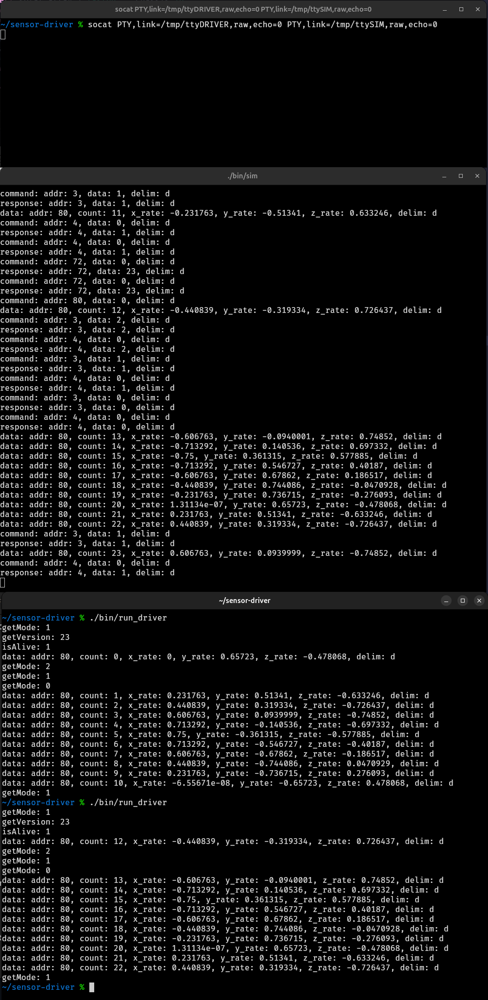

# sensor-driver

# Requirements

You'll need g++, make, and socat - install them as follows:

`sudo apt install g++ make socat`

# Compiling

From the root of the repo, run the following:

1. `make distclean`
2. `make`

# Running

In three separate terminals, run the following:

1. `socat PTY,link=/tmp/ttyDRIVER,raw,echo=0 PTY,link=/tmp/ttySIM,raw,echo=0`
   Note: there shouldn't be any permissions issues running this - if there are, I don't think running the rest with sudo will work.
2. `./bin/sim`
   Note: nothing should appear until running `./bin/run_driver`
3. `./bin/run_driver`
   Note: should quickly print out "getMode: ..." and "getVersion: ..." among other messages, and then return successfully.

Note: `./bin/sim` needs to be run before `./bin/run_driver` since the driver does some blocking reads - if they're run out of order, simply ctrl+c the `run_driver` and re-run it - the `sim` should behave nicely if kept running.

# result

If all is successful, you should see the following:

# Notes

## Entrypoints

There are two main entrypoints:

- `run_driver.cpp`: initializes a `SensorDriver` and does some example traffic
- `sim.cpp`: initializes a `SensorSim` and leaves it running.
  Note: this file also has the implementation for the `SensorSim` class, which I realize is a little confusing. Apologies.

## `SensorDriver` vs `SensorSim`

The structure of the code is broken up into two parts; `driver.cpp` and `sim.cpp`. The classes `SensorDriver` and `SensorSim` within them intentionally look similar.
They are both composed of an `IOInterface`, some number of `MessageCoder`'s, and a handful of action/accessor functions.

The functions within `SensorDriver` are fairly low-level, but are _mostly_ stateless. The intent would be some state-knowlegable application is instantiates/controls/uses `SensorDriver`.
The driver itself doesn't require state knowledge, I believe; although the functions `init`/`shutdown` were written with a "running"/"not running" state in mind, they could be folded into the action/accessor functions. I didn't do this mostly for simplicity and readability's sake, and because I didn't have a great plan to.

The high level behavior of `SensorSim` comes from the [EPSON G370 IMU](./g370_datasheet.pdf); there's roughly two modes of operation:

1. request-response: you send a command, and receive some result, and;
2. automatic broadcast: the gyro emits data at some prescribed rate

There's a very thin notion of "registers" but there's little-to-no implementation behind them; they're effectively just switch statement cases. There are lots of other pitfalls and incompletenesses throughout.

## Purpose of `MessageCoder`

Although it doesn't do much in its current state, the intent is to abstract out the frame-level message handling. I'm not happy with how it turned out here, but the desire is to handle cases where even within a single sensor there might be multiple framing schemes.
In mimicking the EPSON G370 the abstraction works, but from past experience it can be dubious with other message schemes; this wouldn't extend well to cases where we need to have retries, error correcting, or even just frame/packet-spanning data.

Note: I'm realizing I'm using the word frame here a lot - this could just as easily go for "packets" as well.

On the whole: there's lots of pitfalls here, and I'd want to spend a decent amount of time figuring this out correctly.

## IOInterface

Similar to `MessageCoder` the intend was to decouple/abstract some of the functions interacting with the hardware. Partially to more easily support different io schemes (e.g. SPI), and partially to make mocking/spoofing easier. In theory there'd be multiple `IOInterfaces`'s', one for SPI, one for unit testing, which we'd link-time incorporate.
